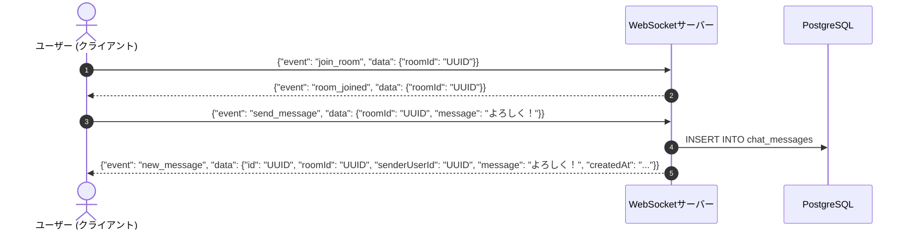

# API設計書

本ドキュメントは、**なんでもマッチング** プラットフォームにおけるWeb API（Next.js Route Handlers）およびリアルタイム通信のインターフェース仕様を定義したものです。

---

## 1. 共通仕様

### 1.1 通信プロトコル & エンドポイント
- **ベースURL**: `https://api.generic-matching.com/api` (ローカル: `http://localhost:3000/api`)
- **データ形式**: JSON (`Content-Type: application/json; charset=utf-8`)
- **認証方式**: HTTP-Only セッションCookie または `Authorization: Bearer <Token>`

### 1.2 共通レスポンスフォーマット

#### 成功時 (2xx)
```json
{
  "success": true,
  "data": { ... }
}
```

#### エラー時 (4xx / 5xx)
```json
{
  "success": false,
  "error": {
    "code": "BAD_REQUEST",
    "message": "入力内容に不備があります。",
    "details": [
      {
        "field": "title",
        "issue": "タイトルは必須です。"
      }
    ]
  }
}
```

### 1.3 エラーコード一覧
| HTTPステータス | エラーコード (`code`) | 説明 |
|---|---|---|
| `400` | `BAD_REQUEST` | バリデーションエラー・リクエスト構文不正 |
| `401` | `UNAUTHORIZED` | 未ログインまたはセッション期限切れ |
| `403` | `FORBIDDEN` | 権限不足（他者のリソースへの不正アクセス等） |
| `404` | `NOT_FOUND` | 指定されたリソース（スレッド、ユーザー、部屋）が存在しない |
| `409` | `CONFLICT` | 重複マッチング、既に存在するリソース |
| `500` | `INTERNAL_SERVER_ERROR` | サーバー内部エラー・DB障害 |

---

## 2. REST API エンドポイント一覧

### 2.1 システム (System)

#### `GET /api/health`
- **概要**: サービス稼働状態およびデータベース接続ヘルスチェック
- **認証**: 不要
- **レスポンス**:
  ```json
  {
    "success": true,
    "data": {
      "status": "ok",
      "timestamp": "2026-09-12T07:13:00.000Z",
      "database": "connected"
    }
  }
  ```

---

### 2.2 ユーザー & プロフィール (Users & Profile)

#### `GET /api/users/me`
- **概要**: ログイン中のユーザー情報およびプロフィール（共通属性 A）取得
- **認証**: 必須
- **レスポンス**:
  ```json
  {
    "success": true,
    "data": {
      "id": "11111111-1111-1111-1111-111111111111",
      "displayName": "たろう",
      "avatarUrl": "https://example.com/avatar.png",
      "profile": {
        "age": 25,
        "gender": "male",
        "location": "東京都",
        "purpose": "ランクマッチ仲間募集",
        "category": "FPS / Apex Legends",
        "isOnline": true
      },
      "providers": ["twitter", "discord"]
    }
  }
  ```

#### `PUT /api/users/me`
- **概要**: 自身の表示名・アバター・共通基本属性 (A) の更新
- **認証**: 必須
- **リクエストボディ**:
  ```json
  {
    "displayName": "たろう_改",
    "avatarUrl": "https://example.com/new-avatar.png",
    "profile": {
      "age": 26,
      "gender": "male",
      "location": "神奈川県",
      "purpose": "カジュアルプレイ",
      "category": "FPS"
    }
  }
  ```

#### `PATCH /api/users/me/online-status`
- **概要**: オンライン / オフライン状態の切り替え
- **認証**: 必須
- **リクエストボディ**: `{ "isOnline": true }`

---

### 2.3 スレッド (Threads)

#### `GET /api/threads`
- **概要**: 募集スレッド一覧取得（検索・絞り込み）
- **クエリパラメータ**:
  - `category` (string, optional): カテゴリ
  - `keyword` (string, optional): タイトル/説明の部分一致
  - `isOnlineOnly` (boolean, optional): 管理者がオンラインのスレッドのみ
  - `limit` (number, default: 20): 取得件数
  - `offset` (number, default: 0): 取得開始位置
- **レスポンス**:
  ```json
  {
    "success": true,
    "data": {
      "threads": [
        {
          "id": "22222222-2222-2222-2222-222222222222",
          "title": "Apexダイヤ帯ランク行ける方！VC必須",
          "description": "今夜21時から2時間程度回せる方募集します。",
          "category": "FPS / Apex Legends",
          "status": "open",
          "createdAt": "2026-09-12T06:00:00.000Z",
          "owner": {
            "id": "11111111-1111-1111-1111-111111111111",
            "displayName": "たろう",
            "avatarUrl": "https://example.com/avatar.png",
            "isOnline": true
          },
          "conditions": [
            { "id": "33333333-...", "key": "game_title", "value": "Apex Legends", "type": "string" },
            { "id": "44444444-...", "key": "platform", "value": "PC", "type": "enum" }
          ]
        }
      ],
      "total": 1,
      "limit": 20,
      "offset": 0,
      "hasMore": false
    }
  }
  ```

#### `POST /api/threads`
- **概要**: 新規スレッド作成
- **認証**: 必須
- **リクエストボディ**:
  ```json
  {
    "title": "Valorant アンレートエンジョイ募集",
    "description": "初心者歓迎です！楽しく遊びましょう",
    "category": "FPS",
    "conditions": [
      { "key": "game_title", "value": "Valorant", "type": "string" },
      { "key": "voice_chat", "value": "Discord", "type": "string" }
    ]
  }
  ```

#### `GET /api/threads/[id]`
- **概要**: スレッド詳細取得（管理者のみ参加者一覧を含む。一般参加者には匿名性保護のため人数のみ返却）
- **認証**: 不要（ログイン時は自身の参加状態も付与）

#### `PUT /api/threads/[id]`
- **概要**: スレッド内容・マッチング条件の更新（スレッド管理者本人のみ）
- **認証**: 必須

#### `DELETE /api/threads/[id]`
- **概要**: スレッドの削除 / クローズ（スレッド管理者本人のみ）
- **認証**: 必須

---

### 2.4 スレッド参加 & マッチング (Participants & Matches)

#### `POST /api/threads/[id]/join`
- **概要**: スレッドへの参加登録 & 独自プロフィール・属性登録
- **認証**: 必須
- **リクエストボディ**:
  ```json
  {
    "customBio": "夜21時以降毎日インしてます！撃ち合い練習中",
    "attributes": [
      { "key": "current_rank", "value": "Diamond 2", "type": "string" },
      { "key": "preferred_agent", "value": "Jett / Raze", "type": "tag" }
    ]
  }
  ```

#### `DELETE /api/threads/[id]/participants/me`
- **概要**: スレッドから退出する
- **認証**: 必須

#### `GET /api/threads/[id]/candidates`
- **概要**: スレッド内のマッチング候補者一覧（推薦・適合スコア順）取得
- **認証**: 必須（スレッド参加者のみ）
- **レスポンス**:
  ```json
  {
    "success": true,
    "data": {
      "candidates": [
        {
          "participantId": "99999999-9999-9999-9999-999999999999",
          "user": {
            "id": "12121212-1212-1212-1212-121212121212",
            "displayName": "じろう",
            "avatarUrl": "https://example.com/jiro.png"
          },
          "customBio": "ランク上げたいです！",
          "attributes": [
            { "key": "current_rank", "value": "Diamond 1", "type": "string" }
          ],
          "compatibilityScore": 92
        }
      ]
    }
  }
  ```

#### `POST /api/threads/[id]/evaluate`
- **概要**: スレッド内参加者に対する Agree（いいね）/ Disagree（スキップ）判定送信
- **認証**: 必須
- **リクエストボディ**:
  ```json
  {
    "targetParticipantId": "99999999-9999-9999-9999-999999999999",
    "isAgree": true
  }
  ```
- **処理**:
  1. 評価レコードを `match_evaluations` に記録。
  2. 相手も自身に対して `isAgree: true` であるか判定（相互合意チェック）。
  3. 相互合意が成立した場合、`matches` を作成し `chat_rooms` を自動生成。
- **レスポンス**:
  ```json
  {
    "success": true,
    "data": {
      "isMatched": true,
      "matchId": "55555555-5555-5555-5555-555555555555",
      "roomId": "66666666-6666-6666-6666-666666666666"
    }
  }
  ```

#### `GET /api/matches`
- **概要**: 自身が参加しているマッチング一覧およびチャットルーム情報取得
- **認証**: 必須

---

### 2.5 チャット (Chat)

#### `GET /api/rooms/[roomId]/messages`
- **概要**: 対象チャットルームの過去メッセージ履歴取得
- **認証**: 必須（マッチング当事者のみ）
- **クエリパラメータ**: `limit` (default: 50), `cursor` (UUID, optional)
- **レスポンス**:
  ```json
  {
    "success": true,
    "data": {
      "messages": [
        {
          "id": "77777777-7777-7777-7777-777777777777",
          "roomId": "66666666-6666-6666-6666-666666666666",
          "senderUserId": "11111111-1111-1111-1111-111111111111",
          "message": "マッチングありがとうございます！よろしくお願いします！",
          "createdAt": "2026-09-12T07:16:00.000Z"
        }
      ],
      "nextCursor": null
    }
  }
  ```

---

## 3. WebSocket リアルタイムチャットプロトコル

### 3.1 接続確立
- **接続URL**: `wss://api.generic-matching.com/ws` (ローカル: `ws://localhost:3000/api/socket`)
- **認証**: 接続ハンドシェイク時にCookieセッションを検証。

### 3.2 イベント定義



#### クライアント送信イベント
| イベント名 | ペイロード (`data`) | 説明 |
|---|---|---|
| `join_room` | `{ "roomId": "UUID" }` | 特定チャットルームへの参加 |
| `leave_room` | `{ "roomId": "UUID" }` | チャットルームからの退出 |
| `send_message` | `{ "roomId": "UUID", "message": "string" }` | テキストメッセージの送信 |

#### サーバー送信イベント
| イベント名 | ペイロード (`data`) | 説明 |
|---|---|---|
| `room_joined` | `{ "roomId": "UUID", "status": "success" }` | 入室完了通知 |
| `new_message` | `{ "id": "UUID", "roomId": "UUID", "senderUserId": "UUID", "message": "string", "createdAt": "ISO8601" }` | 新着メッセージ配信 |
| `error` | `{ "code": "FORBIDDEN", "message": "権限がありません。" }` | エラー通知 |
