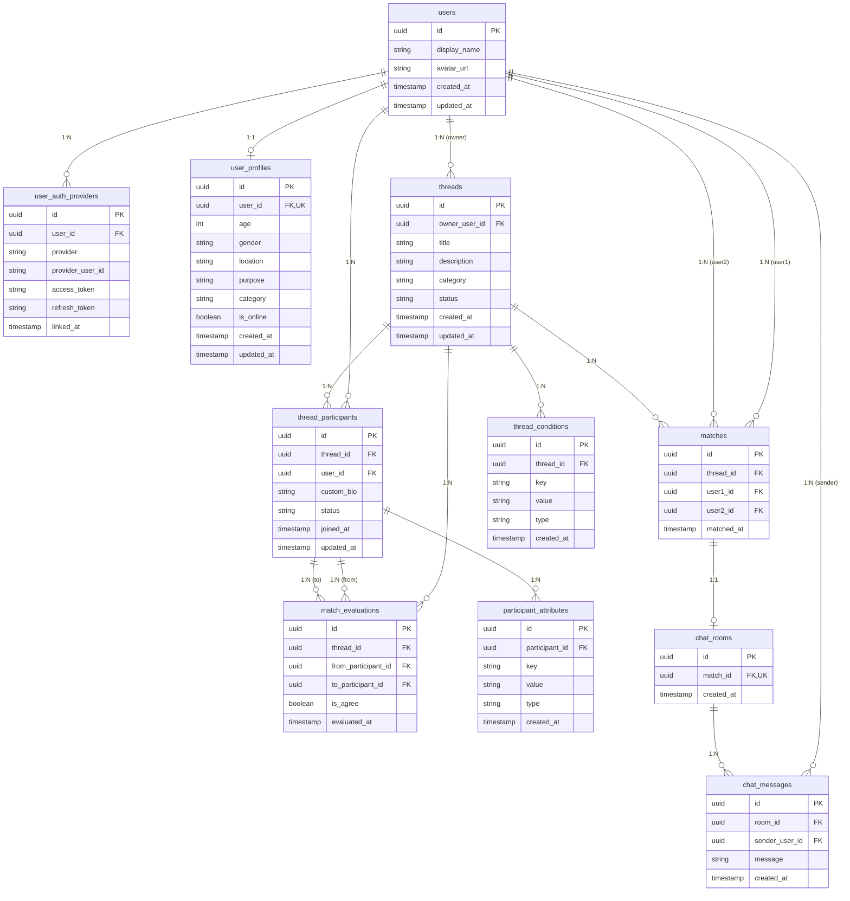

# データベース詳細設計書

本ドキュメントは、**なんでもマッチング** プラットフォームにおけるデータベース（PostgreSQL）の物理設計、ER図、テーブル定義、インデックス戦略、および整合性制約を定義したものです。

---

## 1. データベース概要

- **RDBMS**: PostgreSQL 16
- **ORM / スキーマ管理**: Prisma ORM (`prisma/schema.prisma`)
- **主キー体系**: 全テーブルで UUID (v4) を採用（分散環境・将来のシャーディングを見据えた設計）
- **文字コード / タイムゾーン**: UTF-8 / UTC
- **命名規則**: テーブル名・カラム名ともにスネークケース (`snake_case`)

---

## 2. ER図 (Entity-Relationship Diagram)

---

## 3. テーブル定義書

### 3.1 `users`（ユーザー基本テーブル）

ユーザーアカウントの基本アイデンティティを管理するテーブル。

| カラム名 | データ型 | NULL | デフォルト | キー/制約 | 説明 |
|---|---|---|---|---|---|
| `id` | UUID | NO | `gen_random_uuid()` | PK | 内部ユーザーID |
| `display_name` | VARCHAR(255) | NO | - | - | 表示名（ニックネーム） |
| `avatar_url` | TEXT | YES | NULL | - | アバター画像URL |
| `created_at` | TIMESTAMPTZ | NO | `now()` | - | レコード作成日時 |
| `updated_at` | TIMESTAMPTZ | NO | `now()` | - | レコード更新日時 |

---

### 3.2 `user_auth_providers`（外部認証連携テーブル）

OAuthプロバイダ（Twitter, Instagram, Discord等）との認証紐付け情報。

| カラム名 | データ型 | NULL | デフォルト | キー/制約 | 説明 |
|---|---|---|---|---|---|
| `id` | UUID | NO | `gen_random_uuid()` | PK | 主キー |
| `user_id` | UUID | NO | - | FK (`users.id` CASCADE) | 紐付く内部ユーザーID |
| `provider` | VARCHAR(50) | NO | - | UK (`provider`, `provider_user_id`) | プロバイダ種別 (`twitter`, `discord` 等) |
| `provider_user_id` | VARCHAR(255) | NO | - | UK (`provider`, `provider_user_id`) | プロバイダ側のユーザーID |
| `access_token` | TEXT | YES | NULL | - | OAuthアクセストークン（暗号化推奨） |
| `refresh_token` | TEXT | YES | NULL | - | OAuthリフレッシュトークン（暗号化推奨） |
| `linked_at` | TIMESTAMPTZ | NO | `now()` | - | 連携日時 |

- **インデックス**: `idx_user_auth_providers_user_id` (`user_id`)

---

### 3.3 `user_profiles`（共通基本属性テーブル - A）

全スレッドで共通利用されるユーザーの基本属性情報。

| カラム名 | データ型 | NULL | デフォルト | キー/制約 | 説明 |
|---|---|---|---|---|---|
| `id` | UUID | NO | `gen_random_uuid()` | PK | 主キー |
| `user_id` | UUID | NO | - | FK (`users.id` CASCADE), UK | 紐付く内部ユーザーID (1:1) |
| `age` | INTEGER | YES | NULL | - | 年齢 |
| `gender` | VARCHAR(50) | YES | NULL | - | 性別 |
| `location` | VARCHAR(100) | YES | NULL | - | 居住地域（都道府県/国） |
| `purpose` | VARCHAR(100) | YES | NULL | - | 利用目的（友達作り、ガチ対戦、雑談等） |
| `category` | VARCHAR(100) | YES | NULL | - | メイン趣味・ゲームカテゴリ |
| `is_online` | BOOLEAN | NO | `false` | - | オンライン状態フラグ |
| `created_at` | TIMESTAMPTZ | NO | `now()` | - | 作成日時 |
| `updated_at` | TIMESTAMPTZ | NO | `now()` | - | 更新日時 |

- **インデックス**: 
  - `idx_user_profiles_is_online` (`is_online`)
  - `idx_user_profiles_category` (`category`)
  - `idx_user_profiles_location` (`location`)

---

### 3.4 `threads`（スレッドテーブル）

特定のテーマ・目的で参加者が集まる募集スレッド。

| カラム名 | データ型 | NULL | デフォルト | キー/制約 | 説明 |
|---|---|---|---|---|---|
| `id` | UUID | NO | `gen_random_uuid()` | PK | スレッドID |
| `owner_user_id` | UUID | NO | - | FK (`users.id` CASCADE) | スレッド管理者ID |
| `title` | VARCHAR(255) | NO | - | - | スレッドタイトル |
| `description` | TEXT | YES | NULL | - | スレッド詳細説明 |
| `category` | VARCHAR(100) | NO | `'general'` | - | 募集カテゴリ（ゲーム、趣味、作業等） |
| `status` | VARCHAR(50) | NO | `'open'` | - | ステータス (`open`, `closed`) |
| `created_at` | TIMESTAMPTZ | NO | `now()` | - | 作成日時 |
| `updated_at` | TIMESTAMPTZ | NO | `now()` | - | 更新日時 |

- **インデックス**:
  - `idx_threads_owner_user_id` (`owner_user_id`)
  - `idx_threads_category` (`category`)
  - `idx_threads_status` (`status`)
  - `idx_threads_created_at` (`created_at` DESC)

---

### 3.5 `thread_conditions`（スレッドマッチング条件定義テーブル）

スレッド全体のマッチング条件定義（Key-Value-Type）。

| カラム名 | データ型 | NULL | デフォルト | キー/制約 | 説明 |
|---|---|---|---|---|---|
| `id` | UUID | NO | `gen_random_uuid()` | PK | 条件ID |
| `thread_id` | UUID | NO | - | FK (`threads.id` CASCADE) | 対象スレッドID |
| `key` | VARCHAR(100) | NO | - | - | 条件名（例: `game_title`, `platform`） |
| `value` | TEXT | NO | - | - | 条件値（例: `Apex Legends`, `PC/Steam`） |
| `type` | VARCHAR(50) | NO | `'string'` | - | 判定型 (`string`, `number`, `enum`, `tag`) |
| `created_at` | TIMESTAMPTZ | NO | `now()` | - | 作成日時 |

- **インデックス**:
  - `idx_thread_conditions_thread_id` (`thread_id`)
  - `idx_thread_conditions_key_value` (`key`, `value`)

---

### 3.6 `thread_participants`（スレッド参加情報テーブル）

スレッドに参加しているユーザーの参加情報。スレッド専用プロフィールを保持。

| カラム名 | データ型 | NULL | デフォルト | キー/制約 | 説明 |
|---|---|---|---|---|---|
| `id` | UUID | NO | `gen_random_uuid()` | PK | 参加ID |
| `thread_id` | UUID | NO | - | FK (`threads.id` CASCADE) | 対象スレッドID |
| `user_id` | UUID | NO | - | FK (`users.id` CASCADE) | 参加ユーザーID |
| `custom_bio` | TEXT | YES | NULL | - | スレッド内限定の自己紹介・メッセージ |
| `status` | VARCHAR(50) | NO | `'active'` | - | 参加ステータス (`active`, `left`, `matched`) |
| `joined_at` | TIMESTAMPTZ | NO | `now()` | - | 参加日時 |
| `updated_at` | TIMESTAMPTZ | NO | `now()` | - | 更新日時 |

- **ユニーク制約**: `uk_thread_participants_thread_user` (`thread_id`, `user_id`)
- **インデックス**:
  - `idx_thread_participants_thread_id` (`thread_id`)
  - `idx_thread_participants_user_id` (`user_id`)
  - `idx_thread_participants_status` (`status`)

---

### 3.7 `participant_attributes`（参加者独自属性テーブル）

スレッド参加者が設定する個別属性・希望条件（Key-Value-Type）。

| カラム名 | データ型 | NULL | デフォルト | キー/制約 | 説明 |
|---|---|---|---|---|---|
| `id` | UUID | NO | `gen_random_uuid()` | PK | 属性ID |
| `participant_id` | UUID | NO | - | FK (`thread_participants.id` CASCADE) | 対象参加ID |
| `key` | VARCHAR(100) | NO | - | - | 属性名（例: `current_rank`, `preferred_agent`, `play_time`） |
| `value` | TEXT | NO | - | - | 属性値（例: `Diamond 2`, `Duelist`, `21:00-24:00`） |
| `type` | VARCHAR(50) | NO | `'string'` | - | 属性型 (`string`, `number`, `enum`, `tag`) |
| `created_at` | TIMESTAMPTZ | NO | `now()` | - | 作成日時 |

- **インデックス**:
  - `idx_participant_attributes_participant_id` (`participant_id`)
  - `idx_participant_attributes_key_value` (`key`, `value`)

---

### 3.8 `match_evaluations`（スレッド内参加者評価テーブル）

参加者が他の参加者に対して行った Agree / スキップ 判定記録。

| カラム名 | データ型 | NULL | デフォルト | キー/制約 | 説明 |
|---|---|---|---|---|---|
| `id` | UUID | NO | `gen_random_uuid()` | PK | 評価ID |
| `thread_id` | UUID | NO | - | FK (`threads.id` CASCADE) | 対象スレッドID |
| `from_participant_id` | UUID | NO | - | FK (`thread_participants.id` CASCADE) | 評価送信元参加者ID |
| `to_participant_id` | UUID | NO | - | FK (`thread_participants.id` CASCADE) | 評価対象参加者ID |
| `is_agree` | BOOLEAN | NO | - | - | 評価値 (`true`: Agree, `false`: スキップ) |
| `evaluated_at` | TIMESTAMPTZ | NO | `now()` | - | 評価日時 |

- **ユニーク制約**: `uk_match_evaluations_pair` (`thread_id`, `from_participant_id`, `to_participant_id`)
- **インデックス**:
  - `idx_match_evaluations_thread_id` (`thread_id`)
  - `idx_match_evaluations_from` (`from_participant_id`)
  - `idx_match_evaluations_to` (`to_participant_id`)

---

### 3.9 `matches`（マッチング成立レコードテーブル）

スレッド内での相互Agreeによるマッチング成立情報。

| カラム名 | データ型 | NULL | デフォルト | キー/制約 | 説明 |
|---|---|---|---|---|---|
| `id` | UUID | NO | `gen_random_uuid()` | PK | マッチングID |
| `thread_id` | UUID | NO | - | FK (`threads.id` CASCADE) | 対象スレッドID |
| `user1_id` | UUID | NO | - | FK (`users.id` CASCADE) | マッチング参加者1のユーザーID |
| `user2_id` | UUID | NO | - | FK (`users.id` CASCADE) | マッチング参加者2のユーザーID |
| `matched_at` | TIMESTAMPTZ | NO | `now()` | - | マッチング成立日時 |

- **インデックス**:
  - `idx_matches_thread_id` (`thread_id`)
  - `idx_matches_user1_id` (`user1_id`)
  - `idx_matches_user2_id` (`user2_id`)
  - `idx_matches_matched_at` (`matched_at` DESC)

---

### 3.10 `chat_rooms`（マッチング専用チャットルームテーブル）

マッチング成立ごとに自動生成される専用チャットルーム。

| カラム名 | データ型 | NULL | デフォルト | キー/制約 | 説明 |
|---|---|---|---|---|---|
| `id` | UUID | NO | `gen_random_uuid()` | PK | ルームID |
| `match_id` | UUID | NO | - | FK (`matches.id` CASCADE), UK | 紐付くマッチングID (1:1) |
| `created_at` | TIMESTAMPTZ | NO | `now()` | - | 作成日時 |

---

### 3.8 `chat_messages`（チャットメッセージ履歴テーブル）

チャットルーム内で送受信されたメッセージ。

| カラム名 | データ型 | NULL | デフォルト | キー/制約 | 説明 |
|---|---|---|---|---|---|
| `id` | UUID | NO | `gen_random_uuid()` | PK | メッセージID |
| `room_id` | UUID | NO | - | FK (`chat_rooms.id` CASCADE) | チャットルームID |
| `sender_user_id` | UUID | NO | - | FK (`users.id` CASCADE) | 送信者ユーザーID |
| `message` | TEXT | NO | - | - | メッセージ本文 |
| `created_at` | TIMESTAMPTZ | NO | `now()` | - | 送信日時 |

- **インデックス**:
  - `idx_chat_messages_room_created_at` (`room_id`, `created_at` ASC) - ルームごとの時系列高速取得用
  - `idx_chat_messages_sender_user_id` (`sender_user_id`)

---

## 4. 外部キー制約とカスケード削除ポリシー

- ユーザー（`users`）が削除された場合:
  - 紐付く `user_auth_providers`, `user_profiles`, 作成した `threads`, 参加した `matches`, 送信メッセージ `chat_messages` はすべて `ON DELETE CASCADE` により自動的に整合性を保って削除されます。
- スレッド（`threads`）が削除された場合:
  - 紐付く `thread_conditions`, `matches`（および連鎖して `chat_rooms`, `chat_messages`）が削除されます。

---

## 5. マイグレーション運用方針

1. **開発初期・プロトタイプ段階**:
   - `npm run db:push` を使用して、スキーマ変更を迅速にローカルDBへ直接同期。
2. **本番環境・CI/CD 運用段階**:
   - `npm run db:migrate`（`prisma migrate dev` / `prisma migrate deploy`）を用い、SQLマイグレーションファイルをGit管理下において安全にスキーマ適用を実施。
