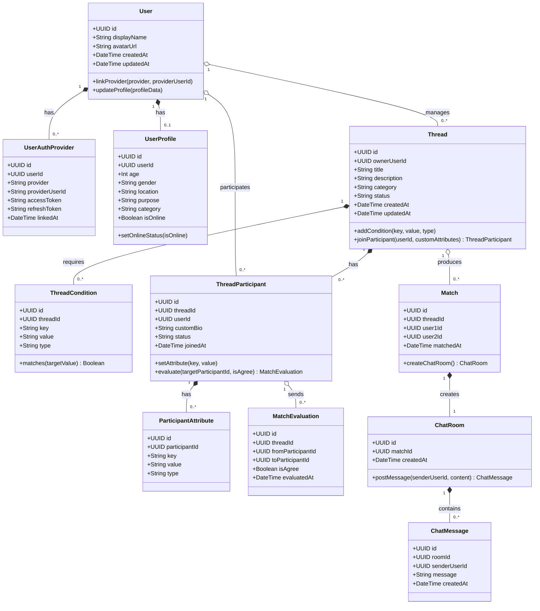

# ドメインモデル定義書

本ドキュメントは、**なんでもマッチング** プラットフォームにおける中核となるドメインモデル、集約境界、ユビキタス言語、およびビジネスルールを定義したものです。

---

## 1. ユビキタス言語（用語集）

| 用語 | 英語表記 | 定義 |
|---|---|---|
| **ユーザー** | `User` | 本サービスを利用する主体。UUIDで識別され、OAuth認証情報と紐づく。 |
| **外部認証情報** | `UserAuthProvider` | X/Twitter、Discord等のOAuthプロバイダから取得した認証連携データ。 |
| **ユーザー共通プロフィール (A)** | `UserProfile` | 年齢、性別、地域、利用目的、メインカテゴリ等の全サービス共通のユーザー基本属性。 |
| **スレッド** | `Thread` | 特定のテーマ・目的（例: 「Apex Legends ランク募集」「週末カフェ友」等）で参加者が集まる募集単位。 |
| **スレッドマッチング条件** | `ThreadCondition` | スレッド管理者が定義するスレッド全体のマッチング条件・必須属性ルール（ゲームタイトル、プラットフォーム等）。 |
| **スレッド参加情報** | `ThreadParticipant` | スレッドに参加しているユーザーの情報。そのスレッド内での専用プロフィール・自己紹介・希望条件を持つ。 |
| **参加者属性** | `ParticipantAttribute` | スレッド参加者がスレッド内で設定する固有の属性・Key-Value情報（現在ランク、使用キャラ、活動時間等）。 |
| **マッチング判定 / 評価** | `MatchEvaluation` | スレッド内である参加者が他の参加者に対して行う適合度判定およびリアクション（Agree / スキップ）。 |
| **マッチング** | `Match` | スレッド内で参加者同士が相互にAgree（双方合意）となり成立したマッチング関係。 |
| **チャットルーム** | `ChatRoom` | マッチング成立によって自動作成される1対1のリアルタイムコミュニケーション空間。 |
| **チャットメッセージ** | `ChatMessage` | チャットルーム内で送受信・記録されるテキストメッセージ。 |

---

## 2. ドメインモデル図

---

## 3. 集約（Aggregates）と境界

### 3.1 ユーザー集約 (User Aggregate)
- **集約ルート**: `User`
- **内部エンティティ**: `UserProfile`, `UserAuthProvider`
- **責務**:
  - ユーザーのアイデンティティ管理
  - 外部OAuth認証情報の紐付けと解除の整合性担保
  - 共通基本属性 (A) の更新およびオンライン状態の変更

### 3.2 スレッド集約 (Thread Aggregate)
- **集約ルート**: `Thread`
- **内部エンティティ / 値オブジェクト**: `ThreadCondition`, `ThreadParticipant`, `ParticipantAttribute`, `MatchEvaluation`
- **責務**:
  - スレッドのライフサイクル（作成、マッチング条件定義、ステータス）管理
  - スレッドへの参加（`ThreadParticipant`）およびスレッド独自属性の整合性担保
  - 参加者間の候補者レコメンドおよび評価（Agree / スキップ）の受付
  - 双方合意（Mutual Agree）の検知と `Match` 生成イベントの発行
  - **匿名性保護**: スレッド参加者一覧の閲覧権限はスレッド管理者のみに制限

### 3.3 マッチング・チャット集約 (Match & Chat Aggregate)
- **集約ルート**: `Match`
- **関連エンティティ**: `ChatRoom`, `ChatMessage`
- **責務**:
  - 成立したマッチング関係（1対1ペア）の確定と履歴保持
  - 専用チャットルームの一意な自動プロビジョニング（1:1リレーション）
  - チャットルーム内でのメッセージ送受信と履歴の整合性担保

---

## 4. ビジネスルール & 制約事項

1. **スレッド参加と独自プロフィール設定**:
   - ユーザーは1つのスレッドに対して1つの `ThreadParticipant` 参加情報を作成できる（`[threadId, userId]` ユニーク制約）。
   - スレッド参加時、スレッドのテーマに合わせた独自プロフィール文やカスタム属性（`ParticipantAttribute`）を登録・更新できる。

2. **参加者一覧の匿名性保護**:
   - スレッド内の全参加者一覧は、当該スレッドの管理者のみが閲覧できる。一般参加者にはマッチング評価用のおすすめ候補者のみが1対1で推薦される。

3. **自己評価・自己マッチングの禁止**:
   - 参加者は自分自身に対して評価（Agree / スキップ）を行うことはできない。

4. **双方合意（Mutual Agree）によるマッチング成立**:
   - 参加者Xが参加者Yに対してAgreeし、参加者Yも参加者Xに対してAgreeした場合にのみ `Match` レコードが作成される。
   - 一度成立した同一ペアかつ同一スレッドでの重複マッチングは作成されない。

5. **チャットルームのライフサイクル**:
   - 1つの `Match` レコードに対して生成される `ChatRoom` は厳密に1つのみ（1:1リレーション）。
   - チャットメッセージを送信できるのは、当該マッチングの当事者2名に限定される。
