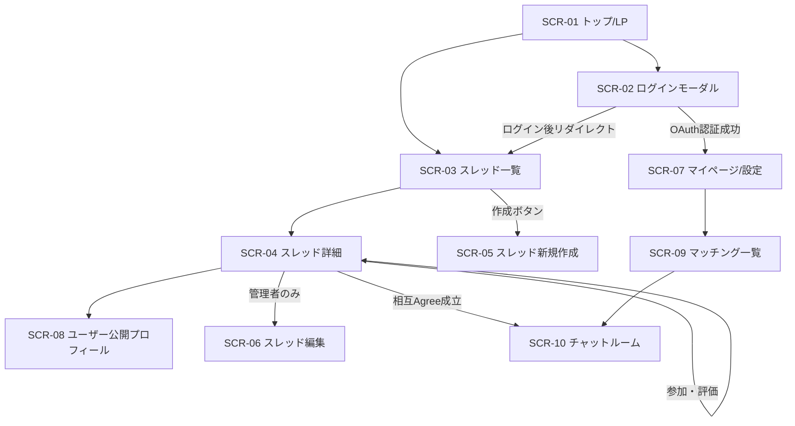

# 画面設計書

本ドキュメントは、**なんでもマッチング** プラットフォームにおける画面構成、画面遷移フロー、ワイヤーフレーム構造、およびUIコンポーネント仕様を定義したものです。

---

## 1. UI/UX設計方針

### 1.1 デザイン原則 (Design Principles)
- **親しみやすさと心理的安全性 (Warmth & Psychological Safety)**: ホワイトベージュ・ライトグレーを基調とし、丸みのある造形（`rounded-2xl`, `rounded-xl`）と落ち着いたパステルトーンで安心感のある空間を演出。
- **認知的負荷の軽減・シンプルな意思決定 (Simplicity & Low Cognitive Load)**: 1画面あたりの情報量・選択肢を絞り込み、スレッド参加や候補者評価（Agree/スキップ）に迷わない直感的な導線を設計。
- **クリーン & ハイコントラスト**: ホワイトベージュ背景と深みのあるチャコールグレー文字により長時間の閲覧でも疲れない高可読性を確保。
- **階層性と情報整理**: スレッド条件タグや評価アクションボタンの重要度をカード構造・バッジ色・フォントウェイトで直感的に伝達。
- **一貫した余白・コンポーネント造形**: 4px/8pxグリッドベースの余白設計、繊細なボーダーと柔らかなシャドウで調和を保持。
- **明瞭な状態フィードバック**: ホバー、フォーカス、ローディング、トースト通知等を穏やかかつ即座に表現。

### 1.2 カラーシステム (北欧ナチュラル × 落ち着いたパステル)
| 役割 | カラー名 | カラーコード / Tailwind | 用途 |
|---|---|---|---|
| ベース背景 | Warm Beige / Ecru | `#F9F8F6` (`bg-stone-50`) | 全体ページのベース背景 |
| カード / サーフェス | Pure Soft White | `#FFFFFF` (`bg-white`) | カード、モーダル、入力フォーム |
| メインテキスト | Charcoal Slate | `#2D3748` (`text-slate-800`) | 主要タイトル、本文、ラベル |
| サブテキスト | Muted Gray | `#718096` (`text-slate-500`) | 補足テキスト、日付、ヒント情報 |
| メインアクセント | Sage Green | `#6E8B74` / `#7D9D85` | 主要CTA、マッチング成立、重要操作 |
| サブアクセント (情報) | Dusty Blue | `#6B8EAE` / `#7C9CB9` | カテゴリタグ、情報バッジ、リンク導線 |
| サブアクセント (好意) | Muted Terracotta / Peach | `#D9826C` / `#E09F8D` | Agree（いいね）評価、重要通知バッジ |
| 境界線・区切り | Soft Border | `#EAE6DF` (`border-stone-200`) | カード・入力欄の繊細な境界線 |

### 1.3 コンポーネント造形ルール
- **角丸**: カード・モーダルは `rounded-2xl`、ボタン・入力欄は `rounded-xl`、タグ・バッジ・アバターは `rounded-full`。
- **シャドウ**: 濃いドロップシャドウを排し、ふんわり広がる柔らかな影（`shadow-sm` や `shadow-md`）を採用。
- **レスポンシブ & モバイルファースト**: スマートフォン（375px〜）、タブレット（768px〜）、デスクトップ（1024px〜）に最適化。
- **プライバシー & 匿名性保護**: スレッド参加者一覧は管理者のみに表示し、一般参加者にはマッチング評価用の1対1候補者レコメンドのみを表示。

---

## 2. 画面一覧

| 画面ID | 画面名 | パス (URL) | 認証要否 | 主な役割 |
|---|---|---|---|---|
| `SCR-01` | **トップ / LP** | `/` | 不要 | サービス概要説明、最新スレッド閲覧への導線、ログイン促進 |
| `SCR-02` | **ログイン / 認証** | `/login` (モーダル) | 不要 | 各SNS（X, Instagram, LINE, Discord等）のOAuthログイン選択 |
| `SCR-03` | **スレッド一覧・検索** | `/threads` | 不要（閲覧のみ） | 募集スレッドの検索・フィルター、新着・人気一覧表示 |
| `SCR-04` | **スレッド詳細・参加** | `/threads/[id]` | 閲覧: 不要 / 参加: 必須 | スレッド詳細確認、参加登録、マッチング評価、スレッド限定独自プロフィール設定（管理者は参加者一覧確認可能） |
| `SCR-05` | **スレッド新規作成** | `/threads/new` | 必須 | スレッド基本情報およびマッチング条件（Key-Value）の設定 |
| `SCR-06` | **スレッド編集** | `/threads/[id]/edit` | 必須（管理者のみ） | 募集スレッドの内容変更・条件更新・募集ステータス変更 |
| `SCR-07` | **マイページ / 設定** | `/profile` | 必須 | プロフィール（基本属性 A）の編集、連携SNS管理、参加スレッド管理 |
| `SCR-08` | **ユーザー公開プロフィール** | `/users/[id]` | 不要 | 他ユーザーの公開プロフィール・管理/参加スレッド履歴の確認 |
| `SCR-09` | **マッチング一覧** | `/matches` | 必須 | 成立したマッチング一覧およびチャットへの導線 |
| `SCR-10` | **リアルタイムチャット** | `/rooms/[id]` | 必須（当事者のみ） | リアルタイム通信を用いた1対1の即時メッセージ送受信 |
| `SCR-11` | **404 / エラー画面** | `/*` | 不要 | 存在しないページやシステム例外時の案内画面 |

---

## 3. 画面遷移図

---

## 4. 各画面の詳細仕様

### 4.1 SCR-01: トップ / LP (`/`)
- **ヘッダー**: サービスロゴ「なんでもマッチング」、スレッド一覧リンク、ログインボタン / ユーザーメニュー。
- **メインビジュアル**: キャッチコピー「自由で柔軟なマッチング条件でつながる」、CTAボタン「募集スレッドを探す」「スレッドを作成する」。
- **特徴紹介セクション**: 「共通属性 × カスタムマッチング条件」「リアルタイムチャット」「匿名性保護」の強み紹介。
- **新着スレッドピックアップ**: 直近作成されたスレッド数件をカード形式で表示。

---

### 4.2 SCR-03: スレッド一覧・検索 (`/threads`)
- **検索・フィルターバー**:
  - キーワード検索フォーム（タイトル・説明文）
  - カテゴリセレクター（ゲーム、雑談、作業、ビジネス等）
  - オンライン管理者スレッドのみ絞り込みトグル
- **スレッドカードリスト**:
  - タイトル、管理者（アバター・名前）、募集カテゴリバッジ
  - マッチング条件タグ一覧（例: `[Apex Legends]` `[Rank: Diamond]` `[VC: Discord]`）
  - 作成日時、現在の参加人数・マッチング成立数
- **ページネーション / フィルター連携**: Next.js Server Components + 検索パラメータ連携。

---

### 4.3 SCR-04: スレッド詳細・参加・候補者評価 (`/threads/[id]`)
- **スレッドヘッダー**: スレッドタイトル、カテゴリバッジ、管理者情報、マッチング条件タグ一覧。
- **スレッド説明文**: スレッドのテーマ、募集要項、詳細説明。
- **アクションエリア**:
  - 未参加時: 「スレッドに参加する」ボタン（押下で自己紹介・個別属性入力モーダルを開き参加登録）
  - 参加済み時: 「参加情報の編集」「退出する」ボタン
  - スレッド管理者の場合: 「スレッド設定を編集」ボタン
- **推薦候補者レコメンドエリア（参加者向け）**:
  - 1対1のマッチング判定に基づく適合候補者一覧（アバター、表示名、適合度%、自己紹介、一致理由、個別属性）。
  - 「Agree（いいね）」/「スキップ」評価アクションボタン。
- **スレッド参加者一覧（管理者専用）**:
  - スレッド管理者のみに表示。全参加者のアバター、名前、参加日時、設定属性を確認可能。一般参加者には非表示（匿名性保護）。
- **マッチング成立モーダル**:
  - 相互Agree成立時にポップアップ表示。「チャットルームへ行く」ボタンから専用チャットへ遷移。

---

### 4.4 SCR-05: スレッド新規作成 (`/threads/new`)
- **入力フォーム**:
  1. **スレッドタイトル**: 必須（最大100文字）
  2. **カテゴリ選択**: セレクトボックス（FPS / RPG / 就活・ビジネス / 趣味等）
  3. **スレッド説明文**: 任意（最大1,000文字）
  4. **マッチング条件（Key-Value）設定**:
     - 「条件を追加」ボタン
     - 条件キー（例: 対象ゲームタイトル、プラットフォーム等）
     - 条件値（例: Apex Legends, PC）
     - 条件タイプ選択（string, number, enum, tag）
- **プレビュー & 作成ボタン**: バリデーション後にスレッドを作成し、詳細画面へ遷移。

---

### 4.5 SCR-07: マイページ / プロフィール編集 (`/profile`)
- **基本情報エリア**: アバター画像プレビュー・変更、表示名編集。
- **共通属性設定（A）**:
  - 年齢、性別、居住地域、利用目的、メインカテゴリ。
  - オンライン状態（トグルスイッチ）。
- **管理スレッド・参加スレッド一覧**:
  - 自身が管理しているスレッドおよび参加しているスレッド一覧。
- **連携SNSアカウント一覧**:
  - 連携済みプロバイダ（X, Discord, LINE, Instagram等）とアイコン、プロバイダユーザー名。
  - 「別のアカウントを連携する」ボタン。

---

### 4.6 SCR-10: リアルタイムチャットルーム (`/rooms/[id]`)
- **チャットヘッダー**: マッチング相手のユーザー名、アバター、オンラインステータス、対象スレッドタイトルへのリンク。
- **メッセージタイムライン**:
  - 相手メッセージ（左配置）/ 自身メッセージ（右配置）
  - 送信時刻、アバターアイコン
  - 自動最下部スクロール
- **入力フォーム**:
  - テキスト入力エリア（複数行対応 / Enterで送信, Shift+Enterで改行）
  - 送信ボタン（リアルタイム送信）
